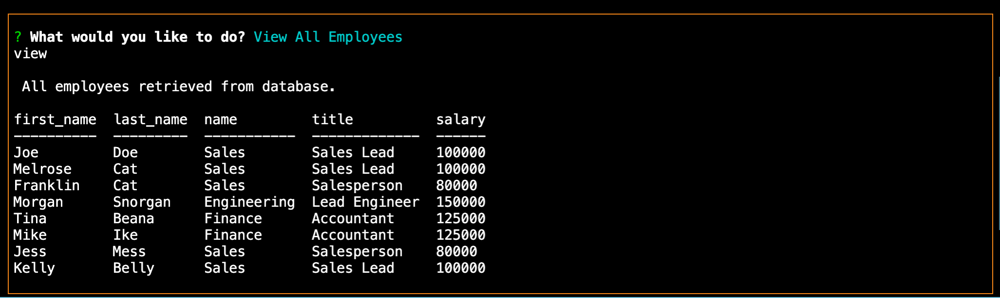
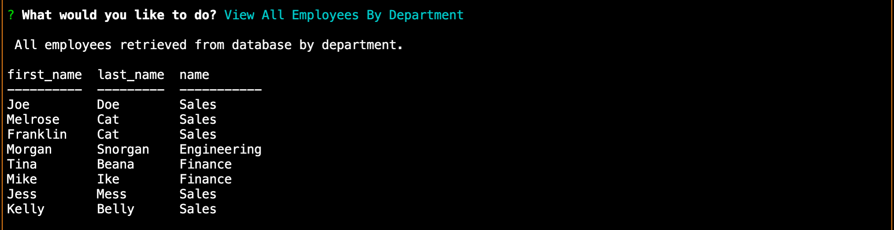
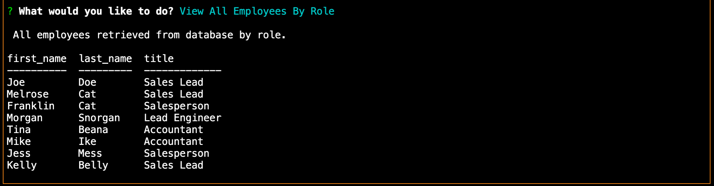
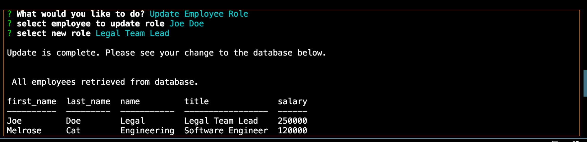
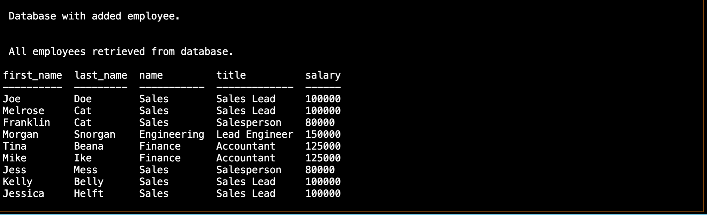

# **Employee-Tracker**
------

## **Contributors**

@KingKitty89

## **Description**

For this project I created a command line interface that will make it easy for non-developers to use and interact with a database of informtion. The application is a content management system that keeps track of employee information. It allows a user to view a database of employees and their corresponding roles, titles, salaries, role id, and manager's id. The user can view all employees, or minimize their search criteria and view all employees by department or role. The user will have the ablitity to add an employee to the database by providing a corresopnding role id and manager id. The user will also be able to update an employee's role. I used a combination of node, inquirer, and MySQL to build this application.

## **Technology Stack**
* JavaScript
* Node.js
* inquirer
* MySQL

## **Installation**

npm i

## **Usage**

This application allows a user to view and manage the departments, roles, and employees in a company and maintain an orginized database of information pertaining to each employee.

## **Contact**
* #### **Name:** Jessica Helft (@KingKitty89)
* #### **Email:** [jessicahelft@gmail.com](jessicahelft@gmail.com)
* #### **LinkedIn:** [LinkedIn](https://www.linkedin.com/in/jessicahelft)

## **Tests**

<h3 align ="center"><a href ="https://drive.google.com/file/d/1-M6AeowoiKwrpFP0XIia-DorMAOHwInH/view">Live Demo</a></h3>

